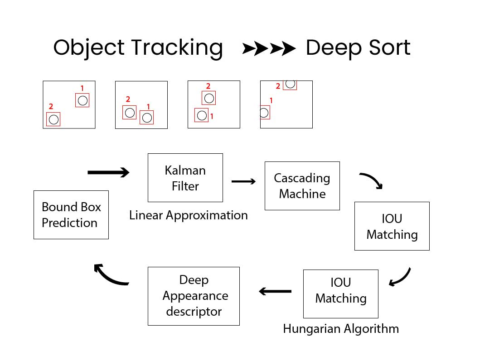

# Deep SORT #
---
Detecting and tracking objects are among the most prevalent and challenging tasks that a surveillance system has to accomplish in order to determine meaningful events and suspicious activities. Object detection in videos involves verifying the presence of an object in image sequences and possibly locating it precisely for recognition. This is done by solving the temporal correspondence problem, the problem of matching the target region in successive frames of a sequence of images taken at closely-spaced time intervals.

Deep SORT is a recent algorithm for tracking that extends Simple Online and Real-time Tracking and has shown remarkable results in the Multiple Object Tracking (MOT) problem. 

### How it works ###

It consists of the following steps:
1.Bounding Box Prediction: Achieved via YOLO algorithm.
2.Kalman Filter: Linear approximation that gives a probability distribution of the path that an object takes and helps in taking care of occlusion using Mahalanobis Distance.
3.Deep Appearance Descriptor:Helps in identifying how similar are two points via cosine distance.By comparing outputs of Kalman Filter and Deep Appearance Filter we can identify if an object is same in evry frame.
4.Cascade Matching and IoU(Intersection over Union) Matching:
Helps in identifying the position of a vehicle in every frame via an algorithm called the Hungarian Algorithm.

### Architecture ###

### Dataset ###

[KITTI road segmentation dataset](https://www.kaggle.com/datasets/sakshaymahna/kittiroadsegmentation)